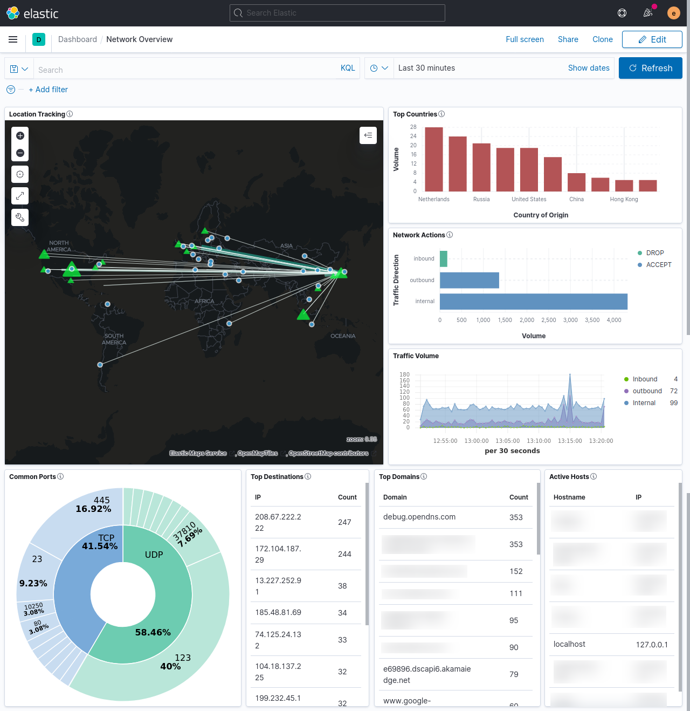

#Introduction

I created this SIEM system to monitor my home network, and I hope it may prove useful for others who may want to learn more about what's actually happening on their networks.

The system is built on the [ELK stack](https://www.elastic.co/) and, currently, only ingests logfiles exported from a router running [DD-WRT](https://dd-wrt.com/).  I plan to add support for Snort and, possibly, various other applications in the future.

Table of Contents
* [Installation](docs/install.md)
* [Configuration](docs/config.md)
